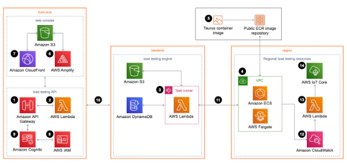

### Distributed Load Testing on AWS

##### Introduction

Distributed Load Testing on AWS is a solution that allows you to perform load testing on your applications or systems hosted on Amazon Web Services (AWS) to evaluate the ability of a system, software, or application to manage demand. This is crucial to ensure that applications can scale and manage large numbers of users or concurrent requests.

For more details about the solution, access the [AWS Solution page](https://aws.amazon.com/solutions/distributed-load-testing-on-aws/).

##### Architecture

##### Prerequisites

1. An AWS account

##### Deployment

AWS provides a Cloudformation template to deploy the solution.

1. Log into your AWS account
2. Access the Cloudformation service and click on create stack
3. In the "Specify template" section, select Amazon S3 URL and paste the following content: https://s3.amazonaws.com/solutions-reference/distributed-load-testing-on-aws/latest/distributed-load-testing-on-aws.template
4. Click on Next
5. In the "Specify stack details" section, fill in the parameters according to your needs
6. Click on Next
7. In the "Configure stack options" section, click on Next
8. In the "Review" section, check the box "I acknowledge that AWS CloudFormation might create IAM resources with custom names."
9. Click on Create stack

After this, you'll receive an email with the login information to access the Load Testing platform.

##### Test options

The Load Testing platform provides two options to run tests:

1. Single URL: Allows you to run a test against a single URL
2. JMeter: Allows you to run a test using a JMeter script to allow more complex tests

This repo includes an example (**simple-http.jmx**) of a JMeter script that you can use to test the platform.

##### How to use the example?

1. Clone the repo
2. Edit the lines 32-42 according with your desired configuration - domain, port, protocol, path...
3. Upload edited JMX file via browser to the deployed AWS load testing platform
4. Run the test